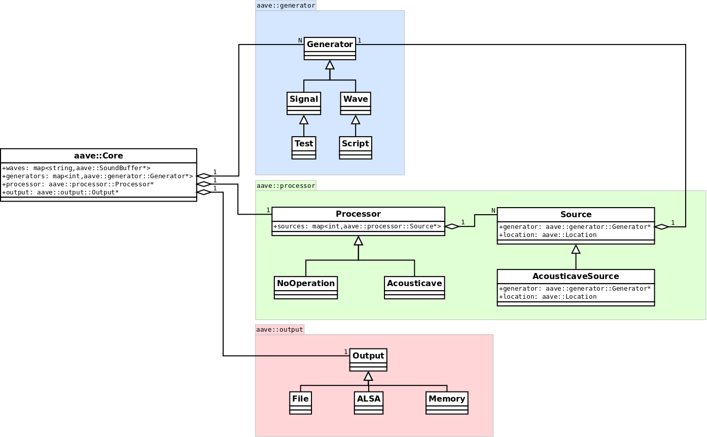

# aserver-audio-server architecture draft



## Naming modification in the diagram:
* aave -> aserver
* Signal -> Primitive

## terminology

* period: the length of a sound buffer, in frames
* frame: a tuple of m samples (m corresponds to the number of output channels)
* sample: a wave intensity (int16)


## namespaces

* aserver: the main namespace, where the top classes reside
* aserver::generator: classes for waveform generation
* aserver::processor: where the auralization is processed
* aserver::output: classes for saving or reproducing the processed audio

## classes

```
    aserver::Core
    map<string, aserver::SoundBuffer*> waves;
    map<int, aserver::generator::Generator*> generators;
    aserver::processor::Processor *processor;
    aserver::output::Output *output;

    void setProcessor(blabla type) {
        switch(type) {
            case blabla::NoOperation: {
                processor = new aserver::processor::NoOperation(params...);
                break;
            } 
            case blabla::Acousticave: {
                processor = new aserver::processor::Acousticave(params...);
                break;
            }
            default:
                fuuuuck
        }
    }
    int addGenerator((enum) generator::blabla type) {
        switch type
            case generator::blabla::Test:
                new generator::Test
    }
    void generatorConfig(int id, generator::ConfigData *configData) {
        generators[id]->config(configData);
    }
    void processorConfig(processor::ConfigData *configData) {
        processor->config(configData);
    }
    int addSource() {
        return processor->addSource(lastGeneratorAdded);
    }
    void setSourceGenerator(int sid, int gid) {
        generator = NULL if gid == -1 else generators[gid];
        processor->setSourceGenerator(sid, generator);
    }
    void render() {
        * iterate over all generators, rendering them
        * processor->render()
        * output->write(processor->buffer)
    }

aserver::SoundBuffer
    int16 data[period * framesize];

aserver::Location
    float x, y, z;

generator::Generator
    aserver::SoundBuffer *buffer;   // period given by the aserver::Core
    map<int, aserver::Location>     // the indexes within the period where there
                                    // were changes in the location of the source

    virtual void config(generator::ConfigData *configData) {}
    virtual void render() {
        buffer->clear();
    }

    * two virtual methods, one to set things up and one to
      render the next period (this base class only renders silence)

generator::Signal : generator::Generator
    int phase, frequency, amplitude, squareFactor;

    * renders a wave as:
        sample = (int16) (tanh(sin(phase) * squareFactor) * amplitude);
    * squareFactor >= 1, amplitude < 32767 (if sample is int16)

generator::Test : generator::Signal
    * renders a periodic signal with increasing frequency in 8 steps
    * starts from 220 Hz @ <0, 2, 0> (2m in front of listener at 
      the origin and default orientation)
    * each step lasts for 500 ms
    * rotates clockwise 45 degrees around the z-axis and multiplies
      the frequency by 2^(1/12) = 1.0594630943592953 (one note up in the
      chromatic scale)
    * after the 8th step, returns to the start (220 Hz @ <0, 2, 0>)

generator::Wave : generator::Generator
    aserver::SoundBuffer *wave; // data from the .wav file
    float position = -1, increment;

generator::ConfigData

generator::ScriptConfigData : generator::ConfigData
    keyframes and stuff

generator::Script : generator::Wave
    vector<Keyframes> keyframes;

    virtual void config(processor::ConfigData *configData) {
        auto cfg = (ScriptConfigData*) configData;
        if (cfg->flags & blabla::addKeyframe) {
            bla bla bla
        }
    }


processor::Processor
    aserver::SoundBuffer *buffer;   // period given by the aserver::Core
    map<int, processor::Source*> sources;

    virtual void config(void *configData)=0; // the class is abstract
    virtual void addSource()=0;
    virtual void render()=0;

processor::Source
    aserver::generator::Generator *generator;
    aserver::Location location;

processor::NoOperation : processor::Processor
    virtual void config(processor::ConfigData *configData) {}
    virtual void addSource() {
        auto source = new processor::Source
        insert it
    }

    virtual void render() {
        mix sources into buffer;
    }

processor::AcousticaveSource : processor::Source
    ...

processor::ConfigData
    * it will probably be empty...?

processor::AcousticaveConfigData : processor::ConfigData

processor::Acousticave : processor::Processor
    virtual void config(processor::ConfigData *configData) {
        auto cfg = (AcousticaveConfigData*) configData;
        if (cfg->flags & blabla::setReverb) {
            bla bla bla
        }
    }
    virtual void addSource() {
        auto source = new processor::AcousticaveSource
        insert it
    }

    virtual void render() {
        do whatever Acousticave needs to be done,
        then copy the results into `buffer`;
    }

output::Output
    virtual void write(SoundBuffer &buffer)=0;

output::File : output::Output

output::ALSA : output::Output

output::Memory : output::Output
    * collects the audio data for tests
```

## example of a main loop

```
int main()
{
    aserver::Core core;
    aserver::processor::AcousticaveConfigData processorConfig;
    core.setProcessor(blabla::Acousticave);
    core.setOutput(blabla2::File); // default config saves to output.wav
    processorConfig.flags = blabla::setReverb | blabla::setWhatever;
    processorConfig.reverb = 2;
    processorConfig.reverbBla = 400;
    processorConfig.whatever = hum milhao de escudos;
    core.processorConfig(&processorConfig);
    int gid = core.addGenerator(blabla::Test);
    int sid = core.addSource();
    // we may convene that a source is automatically configured with the
    // last added generator, so we don't have to explicitly do the following:
    core.setSourceGenerator(sid, gid);
    for (int i=0; i<1000; i++) {
        core.render();
    }
    core.shutdown();
}
```
## Proposed alterations:

* generator::Wave -> generator::Wavefile (to distiguish between sin waves and .wav files)
* generator::Test -> generator::ChromaticRotationTest (more tests will probably be implemented)
* Possibility of using scripts (keyframes) for signals (inheritance in the diagram)?

## Questions:
* New implementation => new client?
* Include reading mp3 files?
* Signal transformations (future work)?
* 

## Recent alterations:
    * Added Output::init virtual method for output initialization. All output types will need this method.
